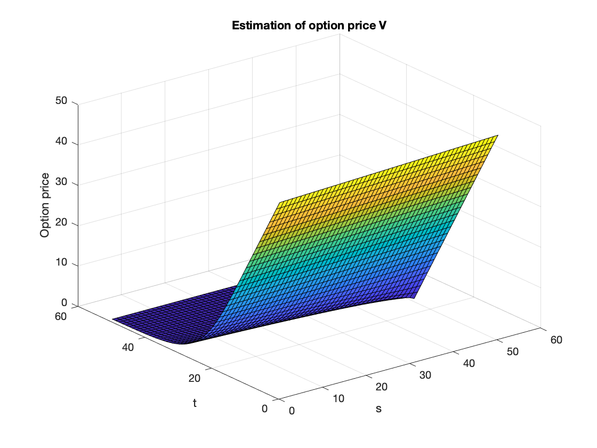
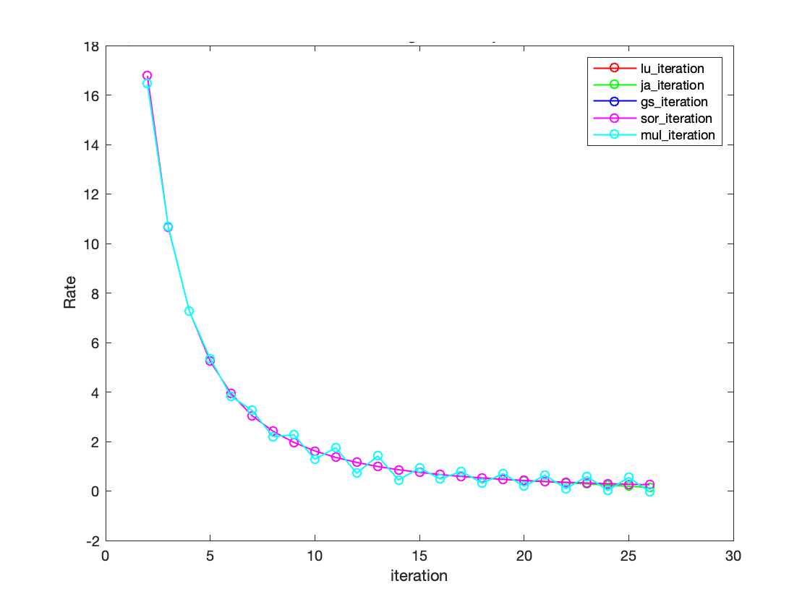

# Black-Scholes-Numerical-Algorithms

This is the repository documenting my MATH 221: Numerical Linear Algebra final project. In this project, I focused on evaluating the performance of various linear system solvers for solving the discretized Black-Scholes equation. The implemented solvers include Jacobi, Gauss-Seidel, Successive Over-Relaxation (SOR) method, and multigrid method, all implemented in Matlab.

## Problem Description

The Black-Scholes equation is a fundamental tool in financial mathematics for pricing options. To numerically solve this equation, the equation is discretized using a backward difference scheme to ensure numerical stability.

    

## Implemented Solvers

1. **Jacobi Method**: A basic iterative solver for linear systems.
2. **Gauss-Seidel Method**: An improvement upon Jacobi, using updated values during the iteration.
3. **SOR Method (Successive Over-Relaxation)**: A modification of Gauss-Seidel with an over-relaxation parameter to accelerate convergence.
4. **Multigrid Method**: A more sophisticated solver that uses a hierarchy of grids to solve the linear system efficiently.

## Results

I compared the solvers based on three key metrics: the execution time, convergence rate, and accuracy. The results revealed that all algorithms demonstrated a similar rate of convergence and accuracy. However, in terms of computation time, the SOR method and multigrid method outperformed Jacobi and Gauss-Seidel significantly.

    

    

